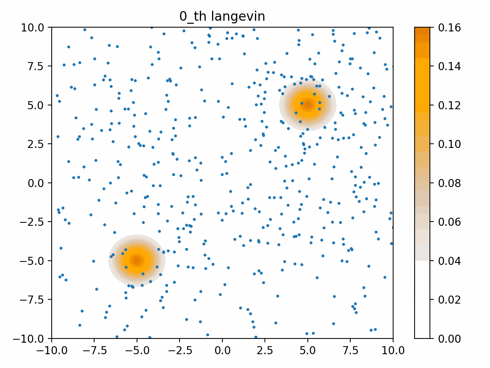
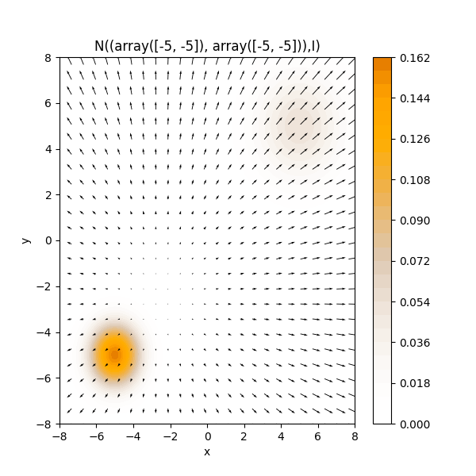
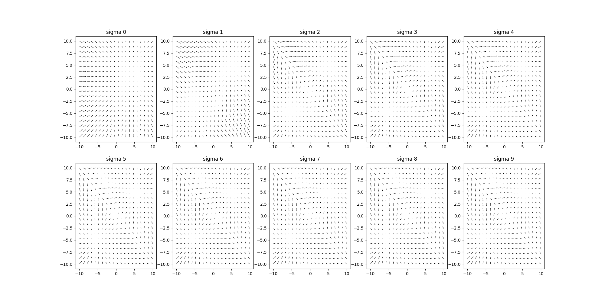
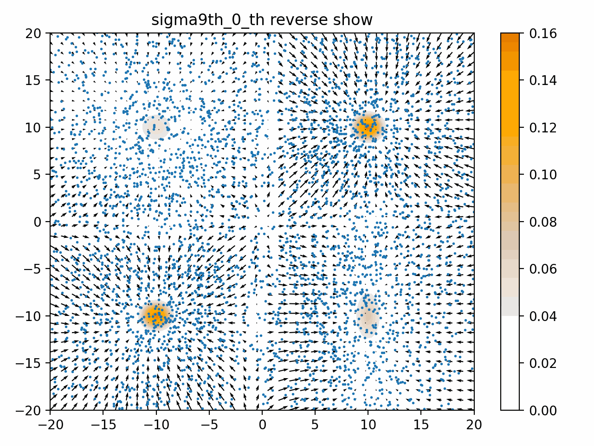

# Object
Implementation for toy example in paper that "Generative Modeling by Estimating Gradients of the Data Distribution"

# Summary
+ NCSN_toy_Example.ipynb : Jupyter Notebook for testing implementation

+ Forward process using Multi Gaussian distribution
> we just add Gaussian Noise

-----

+ In this paper, Setting $p_{data}(x) = \frac{1}{5}N([-5,-5],I) +\frac{4}{5}N([5,5],I) $

-----

+ So, two distribution score vector filed represent like this. 

The image file means, score function represent mean between two distribution. 

----

----

-----

---

----

----

 
